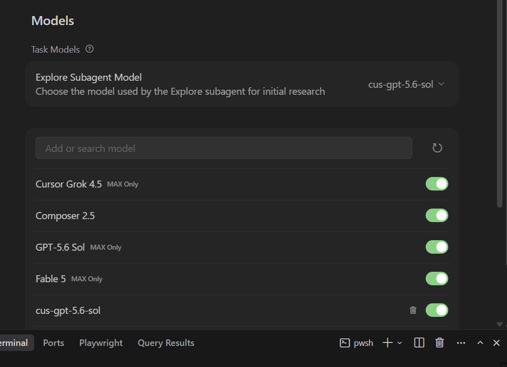
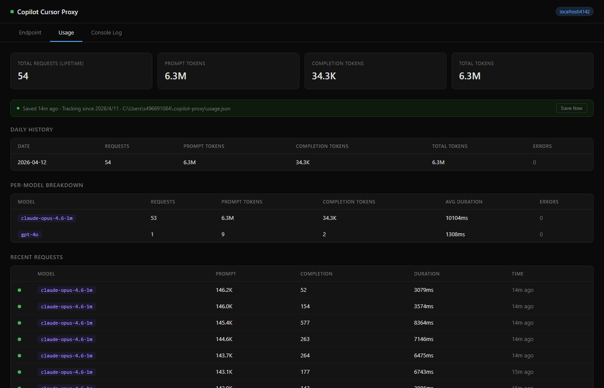
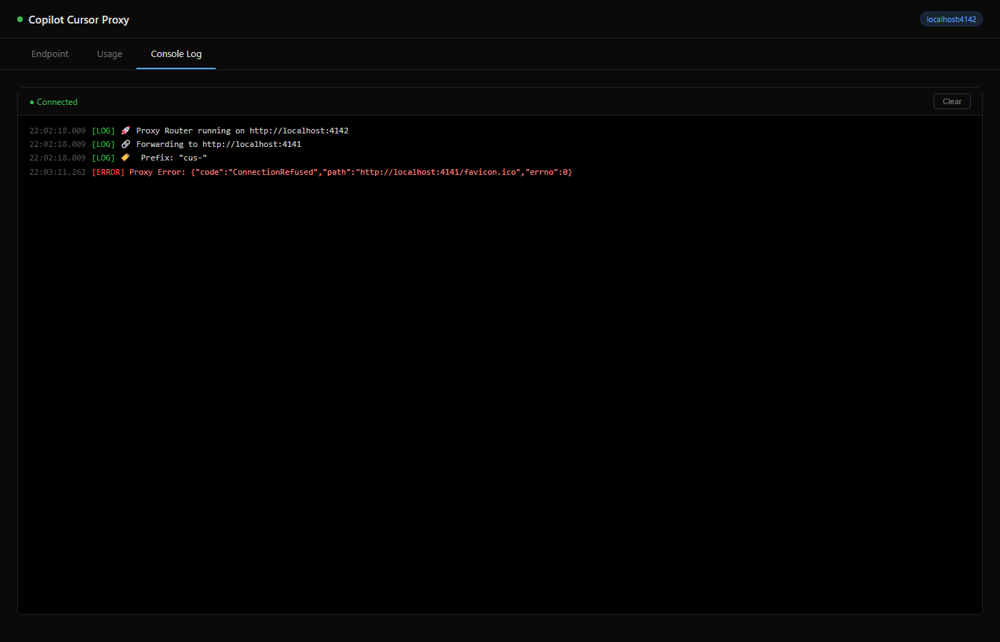

# 🚀 Copilot Proxy for Cursor

> Forked from [jacksonkasi1/copilot-for-cursor](https://github.com/jacksonkasi1/copilot-for-cursor) with full Anthropic → OpenAI conversion + Responses API bridge.

**Unlock the full power of GitHub Copilot in Cursor IDE.**

Use **all** Copilot models (GPT-5.6, Claude Opus 4.8, Gemini 3.5, etc.) in Cursor — including Plan mode, Agent mode, and tool calls.

---

## ⚡ Quick Start

### One Command (npm)

```bash
npx copilot-for-cursor
```

> Requires [Bun](https://bun.sh/) installed. First run will prompt GitHub authentication.

This starts both `copilot-api` (port 4141) and the proxy (port 4142) in a single terminal.

### Or from source

```bash
git clone https://github.com/CharlesYWL/copilot-for-cursor.git
cd copilot-for-cursor
bun run start.ts
```

### Enable Max Mode (auto-compact long conversations)

```bash
bun run start.ts --max
```

> **Max mode** automatically compacts conversation history when the estimated token count exceeds 80% of the model's input token limit. It summarizes older messages into a structured summary while keeping the most recent messages intact — letting you have much longer coding sessions without hitting token limits.

> **🛡️ Always-on safety net:** Even without `--max`, the proxy now auto-compacts at **95%** of the model's input limit and falls back to hard truncation of the oldest messages if summarization fails. This prevents Cursor from ever hitting upstream `context_length_exceeded` errors. Use `--max` if you want proactive (80%) compaction for smoother long sessions.

### Start with an HTTPS tunnel

Start the stack and a Cloudflare Quick Tunnel in one command:

```bash
npx copilot-for-cursor --tunnel
```

Choose another provider or suppress a persisted auto-start setting:

```bash
npx copilot-for-cursor --tunnel=ngrok
npx copilot-for-cursor --tunnel=bore
npx copilot-for-cursor --no-tunnel
```

`--tunnel` defaults to `cloudflared`. When the public tunnel is ready, the CLI prints the complete Cursor `/v1` endpoint and copies it to the system clipboard. CLI tunnel flags affect the current run; use the dashboard or live settings API to persist auto-start.

> The tunnel exposes the model API, not the management API. Dashboard and `/api/*` management endpoints are intentionally limited to loopback access.

### Or start a tunnel after launch

Cursor requires HTTPS. You have two options:

**Option A — One-click tunnel (recommended)**

Open the dashboard at `http://localhost:4142/`, go to the **Tunnel** tab, pick a provider (Cloudflare, ngrok, or bore) and click **Start Tunnel**. The public URL, QR code, and Cursor endpoint will appear instantly. Cloudflare is pre-installed automatically — no signup, no config.

**Option B — Run a tunnel manually**

```bash
# Cloudflare (free, no signup)
cloudflared tunnel --url http://localhost:4142

# Or ngrok
ngrok http 4142
```

Copy the HTTPS URL (e.g., `https://xxxxx.trycloudflare.com`).

---

## 🏗 Architecture

```text
Cursor → (HTTPS tunnel) → proxy-router (:4142) → copilot-api (:4141) → GitHub Copilot
```

*   **Port 4141 (`copilot-api`):** Authenticates with GitHub, provides the OpenAI-compatible API, and natively handles the Responses API for GPT-5.x models.
    *   *Powered by [@jeffreycao/copilot-api](https://github.com/caozhiyuan/copilot-api) (installed via `npx`).*
*   **Port 4142 (`proxy-router`):** Converts Anthropic-format messages to OpenAI format, bridges Responses API for GPT-5.x models, handles the `cus-` prefix, and serves the dashboard.
*   **HTTPS tunnel:** Cursor requires HTTPS — a tunnel exposes the local proxy.

### Proxy Router Modules

| File | Responsibility |
|---|---|
| `proxy-router.ts` | Entrypoint — Bun.serve, routing, CORS, dashboard, model list |
| `anthropic-transforms.ts` | Anthropic → OpenAI normalization (fields, tools, messages) |
| `responses-bridge.ts` | Chat Completions → Responses API bridge for GPT-5.x / goldeneye |
| `responses-converters.ts` | Responses API → Chat Completions format (sync & streaming SSE) |
| `stream-proxy.ts` | Streaming passthrough with chunk logging and error detection |
| `debug-logger.ts` | Request/response debug logging helpers |
| `start.ts` | One-command launcher for copilot-api + proxy-router |
| `max-mode.ts` | Auto-compaction for long conversations (`--max` flag) |
| `settings-config.ts` | Persistent live settings (`~/.copilot-proxy/settings.json`) |
| `startup-options.ts` | CLI parsing for max mode and tunnel overrides |
| `usage-db.ts` | Persistent request/token usage tracking |
| `auth-config.ts` | API key generation, validation, and config persistence |
| `upstream-auth.ts` | Upstream copilot-api authentication and key management |

---

## ⚙️ Cursor Configuration

1.  Go to **Settings** (Gear Icon) → **Models**.
2.  Add a new **OpenAI Compatible** model:
    *   **Base URL:** `https://your-tunnel-url.trycloudflare.com/v1`
    *   **API Key:** `dummy` (any value works)
    *   **Model Name:** Use a **prefixed name** — e.g., `cus-gpt-5.6-sol`, `cus-claude-opus-4-8`

> **⚠️ Important:** You **must** use the `cus-` prefix. Without it, Cursor routes the request to its own backend.

> **💡 Tip:** Visit the [Dashboard](http://localhost:4142) to see all available models and copy their IDs.

Cursor exposes **Settings → Models → Task Models → Explore Subagent Model**, where a `cus-*` model can be selected:



> **Known Cursor limitation:** With custom/BYOK models, Cursor may ignore this selection and send the child request with the parent agent's model. The proxy does not force both models to match; it forwards the model ID Cursor sends. Same-model subagents work reliably, while selecting a different Explore model may still inherit the parent model.

### Currently Available Models

The following catalog was returned by GitHub Copilot on July 9, 2026. Availability can change by account, organization policy, and upstream rollout; the dashboard and `/v1/models` endpoint are authoritative.

| Cursor Model Name | Model | Input Limit | Output Limit |
|---|---|---:|---:|
| `cus-claude-haiku-4-5` | Claude Haiku 4.5 | 136K | 64K |
| `cus-claude-opus-4-5` | Claude Opus 4.5 | 168K | 32K |
| `cus-claude-opus-4-6` | Claude Opus 4.6 | 936K | 64K |
| `cus-claude-opus-4-7` | Claude Opus 4.7 | 936K | 64K |
| `cus-claude-opus-4-8` | Claude Opus 4.8 | 936K | 64K |
| `cus-claude-sonnet-4-5` | Claude Sonnet 4.5 | 168K | 32K |
| `cus-claude-sonnet-4-6` | Claude Sonnet 4.6 | 936K | 64K |
| `cus-claude-sonnet-5` | Claude Sonnet 5 | 936K | 64K |
| `cus-gemini-2.5-pro` | Gemini 2.5 Pro | 128K | 64K |
| `cus-gemini-3-flash-preview` | Gemini 3 Flash (Preview) | 128K | 64K |
| `cus-gemini-3.1-pro-preview` | Gemini 3.1 Pro | 936K | 64K |
| `cus-gemini-3.5-flash` | Gemini 3.5 Flash | 936K | 64K |
| `cus-gpt-5-mini` | GPT-5 Mini | 128K | 64K |
| `cus-gpt-5.3-codex` | GPT-5.3 Codex | 272K | 128K |
| `cus-gpt-5.4` | GPT-5.4 | 922K | 128K |
| `cus-gpt-5.4-mini` | GPT-5.4 Mini | 272K | 128K |
| `cus-gpt-5.5` | GPT-5.5 | 922K | 128K |
| `cus-gpt-5.6-luna` | GPT-5.6 Luna | 922K | 128K |
| `cus-gpt-5.6-sol` | GPT-5.6 Sol | 922K | 128K |
| `cus-gpt-5.6-terra` | GPT-5.6 Terra | 922K | 128K |
| `cus-mai-code-1-flash-picker` | MAI-Code-1-Flash | 128K | 128K |

Embedding-only models also listed by the upstream API are `cus-text-embedding-3-small`, `cus-text-embedding-3-small-inference`, and `cus-text-embedding-ada-002`.

> Claude minor-version aliases use dashes in Cursor (for example, `cus-claude-opus-4-8`). The proxy translates them to the dotted upstream ID (`claude-opus-4.8`). GPT-5.x models are automatically routed through the Responses API bridge when required.


---

## ✨ Features

### What the proxy handles

| Cursor sends (Anthropic format) | Proxy converts to (OpenAI format) |
|---|---|
| `system` as top-level field | System message |
| `tool_use` blocks in assistant messages | `tool_calls` array |
| `tool_result` blocks in user messages | `tool` role messages |
| `input_schema` on tools | `parameters` (cleaned) |
| `tool_choice` objects (`auto`/`any`/`tool`) | OpenAI format (`auto`/`required`/function) |
| `stop_sequences` | `stop` |
| `thinking` / `cache_control` blocks | Stripped |
| `metadata` / `anthropic_version` | Stripped |
| Images in Claude requests | `[Image Omitted]` placeholder |
| GPT-5.x `max_tokens` | Converted to `max_completion_tokens` |
| GPT-5.x Responses API | **Bridge built in** (needs `copilot-api` support) |

### Supported Workflows

*   **💬 Chat & Reasoning:** Full conversation context with all models
*   **📋 Plan Mode:** Works with tool calls and multi-turn conversations
*   **🤖 Agent Mode:** File editing, terminal, search, MCP tools
*   **📂 File System:** `Read`, `Write`, `StrReplace`, `Delete`
*   **💻 Terminal:** `Shell` (run commands)
*   **🔍 Search:** `Grep`, `Glob`, `SemanticSearch`
*   **🔌 MCP Tools:** External tools (Neon, Playwright, etc.)
*   **🗜️ Max Mode:** Auto-compact long conversations to stay within token limits (`--max`)
*   **🤖 BYOK Subagents:** Passes `Subagent` and `Task` tools through; local GPT Responses calls remove the invalid cloud-only `cloud_base_branch` argument
*   **⚙️ Live Settings:** Agents can update max mode, API-key enforcement, and tunnel state without restarting

---

## ⚙️ Live Settings API

Use the local management endpoint to inspect or update the running proxy:

```bash
curl http://localhost:4142/api/settings
```

Start a Cloudflare tunnel immediately, remember the provider, and enable tunnel auto-start for future launches:

```bash
curl -X PATCH http://localhost:4142/api/settings \
  -H "Content-Type: application/json" \
  -d '{"maxMode":true,"tunnel":{"enabled":true,"autoStart":true,"provider":"cloudflared"}}'
```

Stop the current tunnel without changing its saved auto-start preference:

```bash
curl -X PATCH http://localhost:4142/api/settings \
  -H "Content-Type: application/json" \
  -d '{"tunnel":{"enabled":false}}'
```

Available fields:

| Field | Type | Behavior |
|---|---|---|
| `maxMode` | boolean | Enables/disables proactive 80% conversation compaction immediately and persists it |
| `requireApiKey` | boolean | Enables/disables API-key enforcement for `/v1/*` requests |
| `tunnel.enabled` | boolean | Starts or stops the tunnel immediately |
| `tunnel.autoStart` | boolean | Starts the saved tunnel provider on future launches |
| `tunnel.provider` | string | `cloudflared`, `ngrok`, or `bore` |
| `tunnel.authtoken` | string | Optional one-time ngrok token; never persisted |

Settings mutations are serialized so concurrent agents cannot overwrite one another. Call management endpoints through `localhost` or another trusted connection; they control the live proxy and tunnel.

---

## 🔒 Security

### Management Access

The dashboard and `/api/*` management endpoints control the local proxy. Keep them on a trusted connection and avoid sharing the dashboard URL. Model requests can be protected separately with API-key enforcement.

### API Key Management

Manage API keys directly from the **Endpoint** tab in the dashboard:

1. Toggle **"Require API Key"** to enable authentication
2. Click **"+ Create Key"** to generate a new `cpk-xxx` key
3. Copy the key (shown only once!) and paste it into Cursor's **API Key** field
4. Enable/disable or delete keys as needed

When enabled, all `/v1/*` requests must include `Authorization: Bearer <your-key>`.


| Usage Tab | Console Log Tab |
|---|---|
|  |  |

---

## 📊 Dashboard

Access the dashboard at **[http://localhost:4142](http://localhost:4142)**

Four tabs:
- **Endpoint** — Proxy URL, API keys, model list
- **Usage** — Request stats, token counts, per-model breakdown, recent requests
- **Tunnel** — Provider selection, live tunnel status, and auto-start preference
- **Console Log** — Real-time proxy logs with color-coded levels

---

## ⚠️ Known Limitations

| Feature | Status |
|---|---|
| Basic chat & tool calling | ✅ Works |
| Streaming | ✅ Works |
| Plan mode | ✅ Works |
| Agent mode | ✅ Works |
| All GPT-5.x models | ✅ Works |
| Max mode (long session compaction) | ✅ Works (`--max` flag) |
| Live settings API | ✅ Works (`GET/PATCH /api/settings`) |
| Tunnel auto-start | ✅ Works (`--tunnel` or persisted dashboard/API setting) |
| BYOK subagents using the parent model | ✅ Works |
| Separate Explore Subagent Model with custom/BYOK models | ⚠️ Cursor may ignore the selection and inherit the parent model |
| Extended thinking (chain-of-thought) | ❌ Stripped |
| Prompt caching (`cache_control`) | ❌ Stripped |
| Claude Vision | ❌ Not supported via Copilot |
| Tunnel URL changes on restart | ⚠️ Use paid plan for fixed subdomain |

---

## 📝 Troubleshooting

**"Model name is not valid" in Cursor:**
Make sure you're using the `cus-` prefix (e.g., `cus-gpt-5.4`, not `gpt-5.4`).

**Plan mode response cuts off:**
Ensure `idleTimeout: 255` is set in `proxy-router.ts` (already configured). Slow models like Opus need longer timeouts.

**GPT-5.x returns "use /v1/responses":**
The proxy auto-routes these. Make sure you're running the latest version.

**Explore subagent uses the same model as the parent:**
This is a Cursor-side limitation observed with custom/BYOK models. Even when a different `cus-*` model is selected under **Settings → Models → Task Models → Explore Subagent Model**, Cursor may send the child request with the parent model ID. The proxy cannot recover the ignored selection because it is not included in the request.

**"connection refused":**
Ensure services are running: `bun run start.ts` or check `http://localhost:4142`.

**GitHub auth never completes / "copilot-api failed to start":**
On first run, `copilot-api` uses GitHub's device-code flow and prints a line like
`Please enter the code "XXXX-XXXX" in https://github.com/login/device`. The launcher
now auto-opens the browser and waits up to 10 minutes for you to finish. If that
fails (firewall, corporate proxy, SSO redirect, etc.), authenticate directly against
`@jeffreycao/copilot-api` and then re-run this tool:

```bash
# Run the device-code flow explicitly — this caches the token locally.
npx @jeffreycao/copilot-api@latest auth

# Then start the stack normally:
bun run start.ts
# or
npx copilot-for-cursor
```

The token is stored at:

- **Windows:** `%USERPROFILE%\.local\share\copilot-api\github_token`
- **macOS / Linux:** `~/.local/share/copilot-api/github_token`

To reset auth, delete that file (and optionally revoke the device at
https://github.com/settings/apps/authorizations).

**Max mode not compacting:**
Compaction only triggers when estimated tokens exceed 80% of the model's limit and there are at least 15 messages. Check the console log for `🗜️ Max mode` messages.

---

> ⚠️ **DISCLAIMER:** This project is **unofficial** and for **educational purposes only**. It interacts with undocumented internal APIs of GitHub Copilot and Cursor. Use at your own risk. The authors are not affiliated with GitHub, Microsoft, or Anysphere (Cursor). Please use your API credits responsibly and in accordance with the provider's Terms of Service.