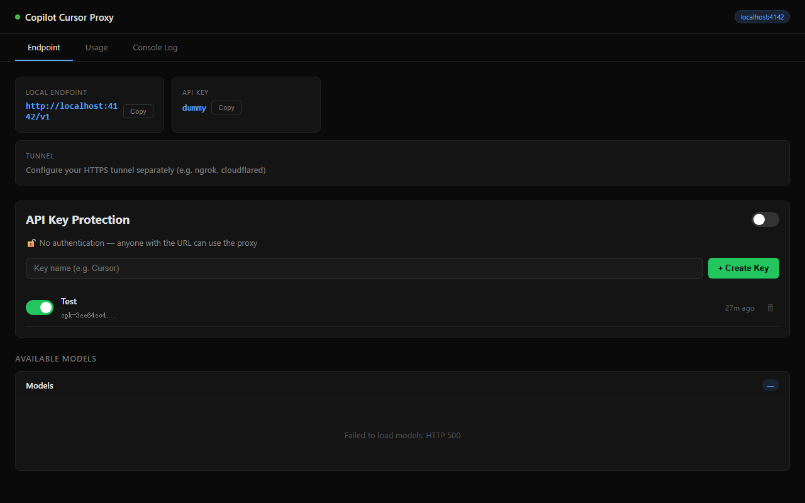

# 🚀 Copilot Proxy for Cursor

> Forked from [jacksonkasi1/copilot-for-cursor](https://github.com/jacksonkasi1/copilot-for-cursor) with fixes for full Anthropic → OpenAI message conversion.

**Unlock the full power of GitHub Copilot in Cursor IDE.**

This project provides a local proxy server that acts as a bridge between Cursor and GitHub Copilot. It solves key limitations by:
1.  **Bypassing Cursor's Model Routing:** Using a custom prefix (`cus-`) to force Cursor to use your own API endpoint instead of its internal backend.
2.  **Enabling Agentic Capabilities:** Transforming Cursor's Anthropic-style tool calls into OpenAI-compatible formats that Copilot understands. This enables **File Editing, Terminal Execution, Codebase Search, and MCP Tools**.
3.  **Fixing Schema Errors:** Automatically sanitizing requests to prevent `400 Bad Request` errors caused by format mismatches (e.g., `tool_choice`, `cache_control`, unsupported content types).

### Changes in this fork

- **Full Anthropic → OpenAI message conversion:** Assistant `tool_use` blocks are converted to OpenAI `tool_calls`; user `tool_result` blocks become `tool` role messages. This fixes `unexpected tool_use_id found in tool_result blocks` errors.
- **Unsupported content type stripping:** Blocks with types like `thinking`, `tool_use` (in user messages), etc. are filtered out before forwarding, preventing `type has to be either 'image_url' or 'text'` errors.
- **Windows setup instructions** added below.

---

## 🏗 Architecture

```
Cursor → (HTTPS tunnel) → proxy-router (:4142) → copilot-api (:4141) → GitHub Copilot
```

*   **Port 4141 (`copilot-api`):** The core service that authenticates with GitHub and provides the OpenAI-compatible API.
    *   *Powered by [caozhiyuan/copilot-api](https://github.com/caozhiyuan/copilot-api) (installed via `npx`).*
*   **Port 4142 (`proxy-router`):** The intelligence layer. It intercepts requests, converts Anthropic-format messages to OpenAI format, handles the `cus-` prefix, and serves the dashboard.
*   **HTTPS tunnel (Cloudflare/ngrok):** Cursor requires HTTPS — a tunnel exposes the local proxy to the internet.

---

## 🛠 Setup Guide

### Prerequisites
*   [Node.js](https://nodejs.org/) & npm
*   [Bun](https://bun.sh/) (for the proxy-router)
*   A tunnel tool — **Cloudflare Tunnel** (free, no signup) or **ngrok**
*   GitHub account with a **Copilot subscription** (individual, business, or enterprise)

### Quick Start (Windows)

Open **3 separate terminals** and run each command:

**Terminal 1 — Start copilot-api (port 4141):**
```sh
npx @jeffreycao/copilot-api@latest start
```
> On first run, it will prompt you to authenticate via GitHub device flow.

**Terminal 2 — Start proxy-router (port 4142):**
```sh
cd copilot-for-cursor
bun run proxy-router.ts
```

**Terminal 3 — Start HTTPS tunnel:**

Using Cloudflare Tunnel (recommended, free, no signup):
```sh
# Install (one-time)
winget install cloudflare.cloudflared

# Run tunnel
cloudflared tunnel --url http://localhost:4142
```

Or using ngrok:
```sh
ngrok http 4142
```

Copy the HTTPS URL from the tunnel output (e.g., `https://xxxxx.trycloudflare.com`).

### Quick Start (macOS)

Run the setup scripts for persistent background services:
```bash
# 1. Setup Core API (Port 4141)
chmod +x setup-copilot-service.sh
./setup-copilot-service.sh

# 2. Setup Proxy Router (Port 4142)
chmod +x setup-proxy-service.sh
./setup-proxy-service.sh

# 3. Start tunnel
ngrok http 4142
```

### Verify Services
Check if the dashboard is running:
👉 **[http://localhost:4142](http://localhost:4142)**



---

## ⚙️ Cursor Configuration

1.  Go to **Settings** (Gear Icon) → **Models**.
2.  Toggle **OFF** "Copilot" (optional, to avoid conflicts).
3.  Add a new **OpenAI Compatible** model:
    *   **Base URL:** `https://your-tunnel-url.trycloudflare.com/v1`
    *   **API Key:** `dummy` (any value works, unless you configured `auth.apiKeys` in copilot-api's `config.json`)
    *   **Model Name:** Use a **prefixed name** — e.g., `cus-gpt-4o`, `cus-claude-sonnet-4`, `cus-claude-sonnet-4.5`

> **💡 Tip:** Go to the [Dashboard](http://localhost:4142) to see all available models and copy their IDs.

> **⚠️ Important:** You **must** use the `cus-` prefix. Without it, Cursor routes the request to its own backend instead of your proxy.

### Available Models (examples)

| Cursor Model Name | Actual Model |
|---|---|
| `cus-gpt-4o` | GPT-4o |
| `cus-gpt-5.4` | GPT-5.4 |
| `cus-claude-sonnet-4` | Claude Sonnet 4 |
| `cus-claude-sonnet-4.5` | Claude Sonnet 4.5 |
| `cus-claude-opus-4.6` | Claude Opus 4.6 |
| `cus-gemini-2.5-pro` | Gemini 2.5 Pro |


---

## 🔒 Security: API Key Protection

If you're using a tunnel (exposing to the public internet), set an API key in copilot-api's config:

**Config location:**
- Linux/macOS: `~/.local/share/copilot-api/config.json`
- Windows: `%USERPROFILE%\.local\share\copilot-api\config.json`

```json
{
  "auth": {
    "apiKeys": ["your-secret-key-here"]
  }
}
```

Then use the same key as the **API Key** in Cursor settings.

---

## ✨ Features & Supported Tools

This proxy enables **full agentic workflows**:

*   **💬 Chat & Reasoning:** Full conversation context with standard models.
*   **📂 File System:** `Read`, `Write`, `StrReplace`, `Delete`.
*   **💻 Terminal:** `Shell` (Run commands).
*   **🔍 Search:** `Grep`, `Glob`, `SemanticSearch`.
*   **🔌 MCP Tools:** Full support for external tools like Neon, Playwright, etc.

### What the proxy handles

| Cursor sends (Anthropic format) | Proxy converts to (OpenAI format) |
|---|---|
| `tool_use` blocks in assistant messages | `tool_calls` array |
| `tool_result` blocks in user messages | `tool` role messages |
| `thinking` blocks | Stripped (not supported) |
| `cache_control` on content blocks | Stripped |
| `input_schema` on tools | Converted to `parameters` |
| Anthropic `tool_choice` objects | OpenAI string format |
| Images in Claude requests | Stripped with `[Image Omitted]` placeholder |

---

## ⚠️ Known Limitations

### Claude Vision
*   **Gemini / GPT-4o:** Full Vision Support ✅
*   **Claude (via Copilot):** Does **NOT** support images via the API proxy ❌

The proxy automatically strips images from Claude requests to prevent crashes.

### What's lost vs native Anthropic API
Since Cursor sends to `/v1/chat/completions` (OpenAI) instead of `/v1/messages` (Anthropic), some features are unavailable:

| Feature | Status |
|---|---|
| Extended thinking (chain-of-thought) | ❌ Stripped |
| Prompt caching (`cache_control`) | ❌ Stripped |
| Context management beta | ❌ Not available |
| Premium request optimization | ❌ Bypassed |
| Basic chat & tool calling | ✅ Works |
| Streaming | ✅ Works |

### Tunnel URL changes on restart
Cloudflare quick tunnels generate a new URL each time. You'll need to update Cursor settings when you restart the tunnel. Consider a paid plan for a fixed subdomain.

---

### 📝 Troubleshooting

**"Model name is not valid" in Cursor:**
Make sure you're using the `cus-` prefix (e.g., `cus-gpt-4o`, not `gpt-4o`).

**"connection refused" on tunnel:**
Ensure all 3 services are running (copilot-api on 4141, proxy-router on 4142, tunnel).

**500 errors from copilot-api:**
Restart copilot-api. If the error mentions `messages`, the proxy should now handle it — make sure you're running the latest `proxy-router.ts`.

**Logs (macOS):**
*   Proxy: `tail -f ~/Library/Logs/copilot-proxy.log`
*   API: `tail -f ~/Library/Logs/copilot-api.log`

---

> ⚠️ **DISCLAIMER:** This project is **unofficial** and created for **educational purposes only**. It interacts with undocumented internal APIs of GitHub Copilot and Cursor. Use at your own risk. The authors are not affiliated with GitHub, Microsoft, or Anysphere (Cursor). Please use your API credits responsibly and in accordance with the provider's Terms of Service.